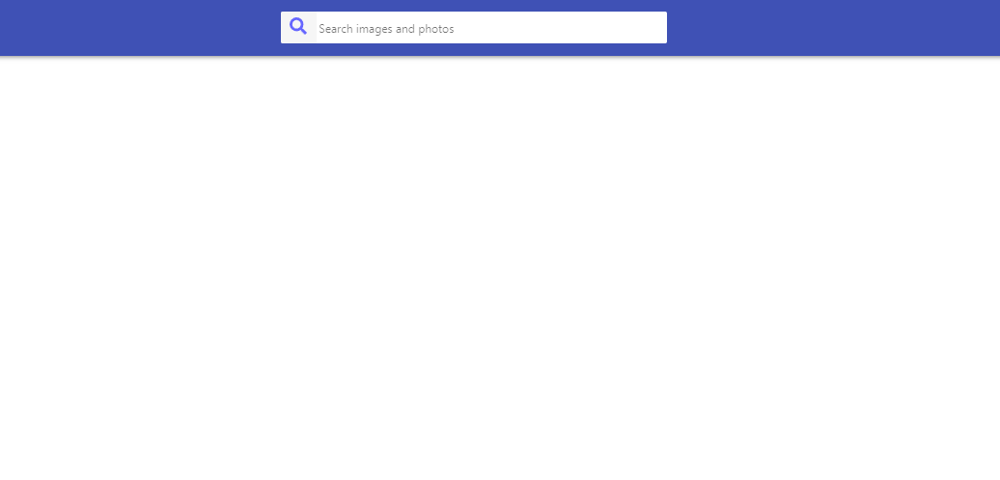
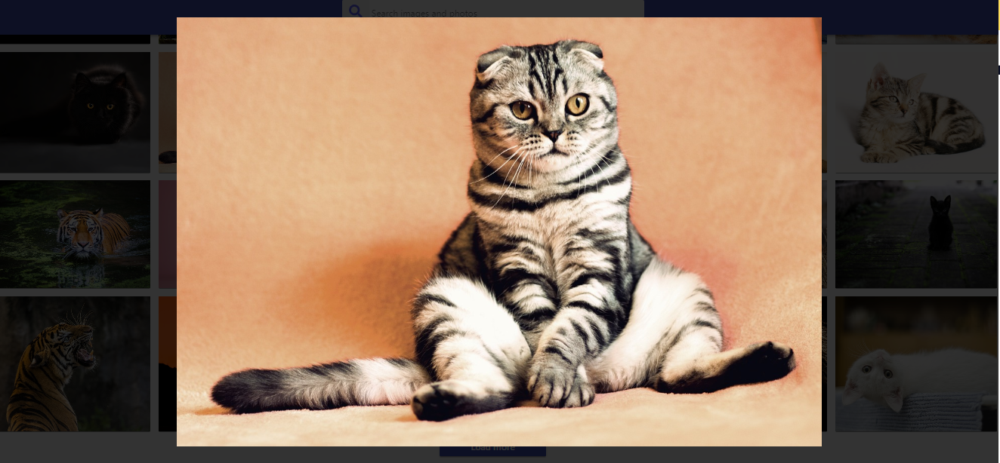
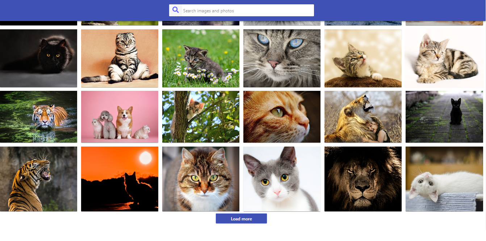
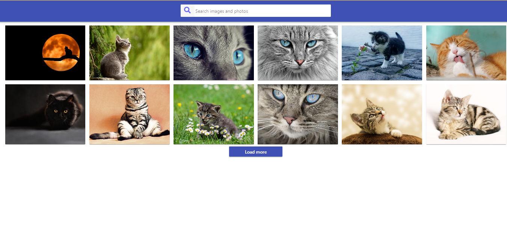

# Images

Наша програма пропонує зручний спосіб перегляду фотографій за вашим запитом. Вона включає в себе пошукове поле, де ви можете вводити ключові слова для пошуку фотографій. При пошуку ви отримуєте результати у вигляді кількох фотографій на сторінці, які відображаються з пагінацією.

Щоб переглянути фотографію в більшому розмірі, ви можете клікнути на кнопку "Переглянути". При цьому відкривається модальне вікно з обраною фотографією, де ви можете детально роздивитися зображення.

Для зручності, модальне вікно можна також закрити, клікнувши на кнопку "Esc" на клавіатурі або клікнувши на бекдроп поза межами фотографії. Це дозволяє вам швидко і легко переглядати багато фотографій, не виходячи зі сторінки пошуку.
 Стилізація виконана Styled Components.

 .
 .
 .
 .
## Контакти

Якщо у вас є питання, пропозиції або вам потрібна допомога, не соромтеся звертатися до нашої служби підтримки за адресою Liussi@ukr.net